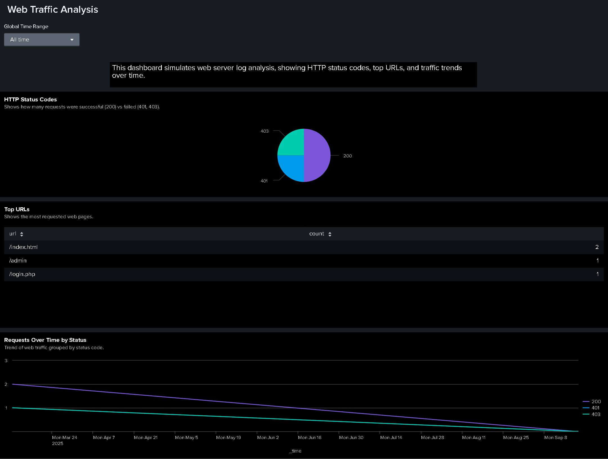

# 👋🏽 King Sanders – Cybersecurity Portfolio
🌐 Portfolio Website: https://cyberbeastking.github.io/

**Entry-Level SOC Analyst | Cybersecurity Professional in Training**

Passionate about protecting organizations through threat detection, log analysis, and incident response. Currently completing the Google Cybersecurity Certificate while building a home SOC lab with Linux, Splunk, and Security Onion. Hands-on practice includes analyzing suspicious logins, documenting incidents, and performing basic vulnerability assessments.

I bring consistency, energy, and a growth mindset — ready to contribute to a SOC team on Day One.

---

## 🧠 Skills & Tools
- Log analysis & incident documentation
- SIEM workflows (Splunk, Security Onion – home lab practice)
- Linux command-line for log navigation & user management
- SQL queries for failed login investigations & device reports
- Network monitoring & packet analysis (Wireshark, tcpdump)
- Cybersecurity tools: nmap, whois, nslookup
- Constant learner (daily labs, podcasts, certifications)

---

## 🔐 Certifications
- [Foundations of Cybersecurity](certifications/coursera-foundations-of-cybersecurity.pdf)
- [Tools of the Trade: Linux and SQL](certifications/coursera-tools-of-the-trade.pdf)
- [Connect and Protect: Networks and Network Security](certifications/coursera-connect-and-protect.pdf)
- [Play It Safe: Manage Security Risks](certifications/coursera-play-it-safe-manage-security-risks.pdf)
- [Assets, Threats, and Vulnerabilities](certifications/Coursera-Assets-Threats-and-Vulnerabilities.pdf)
- [Sound the Alarm: Detection and Response](certifications/Coursera-Sound-the-Alarm-Detection-and-Response.pdf)

---

## 📊 Projects

### Project 1 — Web Traffic Analysis with Splunk
A security-focused dashboard built from custom web logs to show how I ingest data, write SPL, and design visualizations.

**Data**
- **Index:** `project1`
- **Sourcetype:** `web:logs`
- **File:** `web_logs.log` (sample HTTP access logs)

**Screenshot**



<details>

**<summary>See SPL Queries - **Click to Expand**</summary>**

#### 1) HTTP Status Codes
```spl
index=project1 sourcetype=web:logs
| stats count by status
| sort - count
```
#### 2) Requests by URL
```sql
index=project1 sourcetype=web:logs
| stats count by url
| sort - count
```
#### 3) Requests Over Time by Status
```sql
index=project1 sourcetype=web:logs
| timechart span=10m count by status
```
#### 4) Top Source IPs
```sql
index=project1 sourcetype=web:logs
| stats count by src_ip
| sort - count
```
</details>

<h2>SQL Log Analysis – Suspicious Logins</h2>

This project simulates a **brute-force login investigation** using SQL queries on employee login data. The goal was to detect failed login attempts, external access, and suspicious login patterns.

**Dataset**

A synthetic `employee_logins` table with:

`username` – Employee username

`login_time` – Timestamp of login

`ip_addres`s – Source IP

`status` – SUCCESS / FAILED

<details>
  
**<summary>Screenshots - Click to Expand</summary>**

- 
- 
- 
- 
- 
- 

</details>

<details>

**<summary>See SQL Queries - **Click to Expand**</summary>**
  
  #### 1) All Login Records
  ```sql
  SELECT * 
FROM employee_logins
ORDER BY login_time;
```
#### 2)External Logins (Outside Internal IP Range)
```sql
SELECT id, username, login_time, ip_address, status
FROM employee_logins
WHERE ip_address NOT LIKE '192.168.%'
  AND ip_address NOT LIKE '10.%'
  AND ip_address NOT LIKE '172.16.%'
ORDER BY login_time;
```
#### 3)First Failed → First Success (Suspicious Sequence)
```sql
WITH first_failed AS (
  SELECT username, MIN(login_time) AS first_failed_time
  FROM employee_logins
  WHERE status = 'FAILED'
  GROUP BY username
),
first_success AS (
  SELECT username, MIN(login_time) AS first_success_time
  FROM employee_logins
  WHERE status = 'SUCCESS'
  GROUP BY username
)
SELECT f.username, f.first_failed_time, s.first_success_time
FROM first_failed f
JOIN first_success s ON f.username = s.username;
```
#### 4) Failed Attempts per IP
```sql
SELECT ip_address, COUNT(*) AS failed_count
FROM employee_logins
WHERE status = 'FAILED'
GROUP BY ip_address
ORDER BY failed_count DESC, ip_address;
```
#### 5) Logins Over Time (by Hour)
```sql
SELECT strftime('%Y-%m-%d %H:00', login_time) AS hour_bucket,
       SUM(CASE WHEN status = 'SUCCESS' THEN 1 ELSE 0 END) AS success_count,
       SUM(CASE WHEN status = 'FAILED' THEN 1 ELSE 0 END) AS failed_count
FROM employee_logins
GROUP BY hour_bucket
ORDER BY hour_bucket;
```
#### 6) Failed Attempts per User
```sql
SELECT username, COUNT(*) AS failed_attempts
FROM employee_logins
WHERE status = 'FAILED'
GROUP BY username
ORDER BY failed_attempts DESC, username;
```
</details>

## 🚩 Findings

- Multiple failed logins from `192.168.1.11` and `10.0.0.5`.

- User `jdoe` and `admin` showed repeated failures before eventual success — common brute-force pattern.

- External logins from `203.0.113.55 (mary)` indicate possible compromise from outside the network.


<h2>🧪 Labs & Practice (Google Cybersecurity Course)</h2>

### Manage Authorization (Linux Permissions)
<details>
<summary>🔒 Linux Permissions Lab – **Click to Expand**</summary>

**PDFs**
- [Current File Permission (PDF)](manage-authorization/current-file-permissions.pdf)  
- [File Permissions in Linux (PDF)](manage-authorization/file-permissions-in-linux.pdf)  

**Screenshots**
-   
-   
-   
-   

</details>

---

### SQL Filtering – Data Investigation
<details>
<summary>📝 SQL Filtering – Detecting Failed Logins</summary>

**PDFs**
- [Apply Filters to SQL Queries (PDF)](sql-filtering-data-investigation-cybersecurity-practice/apply-filters-to-sql-queries.pdf)  
- [Table Format (PDF)](sql-filtering-data-investigation-cybersecurity-practice/table-formats.pdf)  

**Screenshots**
-   
-   
-   
-   
-   
-   

</details>

---

### SQL Filtering – Employee & Machine Info
<details>
<summary>💻 Employee & Machine Info SQL Lab</summary>

**PDFs**
- [Training Activity Report (PDF)](sql-filtering-practice-employee-machine-info/training-activity-report-1.pdf)  

**Screenshots**
-   
-   
-   
-   
-   
-   

</details>

---

### 📌 Current Goals

- Finish Google Cybersecurity Certificate

- Build a home SOC lab (Kali Linux, Splunk, Security Onion)

- Studying for comptia security+
  
- Land an entry-level SOC role and keep leveling up


"I failed. I learned." – That’s my mindset.

